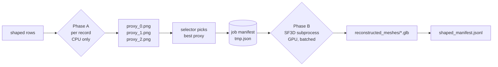

# Patent → 3D Supervision Pipeline: Complete Overview

This document is a top-to-bottom writeup of the pipeline in this repository: what
the dataset is, what each stage does, how the pieces fit together, what was built
during this work session, and how to reproduce the runs that have already been
completed.

It complements the other docs in the repo:

- [WALKTHROUGH.md](WALKTHROUGH.md) — architecture-first summary.
- [DETAILED.md](DETAILED.md) — chronological action log of the engineering work.
- [PROXY_IMAGE_GENERATION.md](PROXY_IMAGE_GENERATION.md) — deep dive on how the
  photorealistic `.png` proxies are produced.

---

## 1. What this project is

The goal is to convert **US design-patent figures** (line-art TIFFs from the
IMPACT dataset) into **textured 3D meshes** (`.glb`) suitable for use as weak
3D supervision for downstream models.

The end product is a JSONL manifest where each row corresponds to one patent
and carries:

- patent metadata (title, claim, CPC class, date, …),
- the original view images,
- a VLM-generated structural schema (parts, relations, symmetries),
- one or more synthesized photoreal proxy images,
- the path to a reconstructed 3D mesh.

The final supervision file lives at
[data/output/patent_3d_supervision.jsonl](data/output/patent_3d_supervision.jsonl).

---

## 2. Dataset

### 2.1 Source: IMPACT

Raw inputs come from the **IMPACT** patent dataset (sampled subset checked into
[data/external/IMPACT/](data/external/IMPACT)). For each patent there is a folder
like `USD0908314-20210126/` containing multiple TIFF views numbered
`-D00000.TIF`, `-D00001.TIF`, …

These are black-and-white line drawings — front / back / left / right /
perspective views of the claimed ornamental design.

### 2.2 Working manifests

The pipeline produces a chain of JSONL manifests under `data/work/`:

| File | Produced by | Purpose |
|---|---|---|
| [data/impact_manifest.jsonl](data/impact_manifest.jsonl) | `ingest` | Raw per-patent rows from IMPACT |
| [data/work/filtered_manifest.jsonl](data/work/filtered_manifest.jsonl) | `filter` | Drops patents that fail basic checks |
| [data/work/masked_manifest.jsonl](data/work/masked_manifest.jsonl) | `masks` | Adds segmentation-mask paths |
| [data/work/posed_manifest.jsonl](data/work/posed_manifest.jsonl) | `poses` | Adds VLM schema / part graph |
| [data/work/shaped_manifest.jsonl](data/work/shaped_manifest.jsonl) | `shapes` | Adds proxy images + 3D mesh path |
| [data/output/patent_3d_supervision.jsonl](data/output/patent_3d_supervision.jsonl) | `package` | Final packaged supervision file |

### 2.3 Auxiliary data

- [data/work/masks/](data/work/masks/) — per-patent `.npz` mask stacks.
- [data/work/vlm_3d/proxies/<patent_id>/proxy_{0,1,2}.png](data/work/vlm_3d/proxies/) —
  Gemini-generated photoreal proxies.
- [data/work/vlm_3d/reconstructed_meshes/<patent_id>.glb](data/work/vlm_3d/reconstructed_meshes/) —
  SF3D outputs.
- [data/shapenet_proxy/](data/shapenet_proxy/) — optional ShapeNet embedding
  index for the alternate "optimize" mode.

---

## 3. Pipeline architecture

### 3.1 Stage map

The CLI ([src/patent_pipeline/cli.py](src/patent_pipeline/cli.py)) exposes the
following stages, each of which reads one manifest and writes the next:

```
ingest → filter → masks → poses → shapes → package
                                    │
                                    └── two modes:
                                          - art3d     (current: Gemini + SF3D)
                                          - optimize  (legacy: primitive fit + ShapeNet retrieval)
```

Run via:

```powershell
python -m src.patent_pipeline.cli <stage> [--mode art3d|optimize] [--patent-id ID[,ID...]] [--limit N]
```

### 3.2 Shapes / art3d sub-pipeline

The `shapes --mode art3d` stage is the heart of the 3D-reconstruction work.
It is split into **two phases** to avoid a Windows-specific CUDA-driver hang
caused by two GPU-using processes sharing the same context:

**Phase A — Per-record preparation (CPU only)**

For each patent row:

1. **Augmentor** ([gemini_augmentor.py](src/patent_pipeline/vlm_3d/augmentor/gemini_augmentor.py)) —
   calls `gemini-2.5-flash-image` `n_candidates` times (default 3) to turn the
   cleaned patent line-art + a prompt derived from the VLM schema into N
   photoreal `.png` "proxy" images saved under
   `data/work/vlm_3d/proxies/<patent_id>/proxy_{i}.png`.
2. **Proxy selector** ([proxy_selector.py](src/patent_pipeline/vlm_3d/augmentor/proxy_selector.py)) —
   sends all N candidates + the original figure to `gemini-2.5-flash` (text
   model) and asks which candidate best preserves the design. Falls back to
   index 0 on any error.
3. The selected proxy path + intended `.glb` output path is queued as a "job"
   for Phase B.

This phase **never touches the GPU**; the parent process explicitly sets
`CUDA_VISIBLE_DEVICES=""` for itself before running it.

**Phase B — Batched SF3D reconstruction (GPU)**

All queued jobs are written to a single temporary JSON manifest, then
[scripts/run_sf3d_external.py](scripts/run_sf3d_external.py) is launched **once**
as a subprocess inside the external `stable-fast-3d` virtualenv:

```
c:\...\patent-3d-viewer\external\stable-fast-3d\.venv\Scripts\python.exe \
    c:\...\patent_lm\scripts\run_sf3d_external.py \
    --jobs <tmp.json> --device cuda
```

The subprocess loads the `stabilityai/stable-fast-3d` model and the `rembg`
session **once**, then iterates the jobs, calling `torch.cuda.empty_cache()`
between them. Its stdout is line-streamed back to the parent. The final line
is `[sf3d-ext] RESULTS=<json>` — the parent parses this and merges the
per-job `{ok, error, output}` results back into the manifest by `patent_id`.



### 3.3 Key files

| File | Role |
|---|---|
| [src/patent_pipeline/cli.py](src/patent_pipeline/cli.py) | Stage dispatcher; orchestrates Phase A/B for art3d |
| [src/patent_pipeline/vlm_3d/loop.py](src/patent_pipeline/vlm_3d/loop.py) | `prepare_art3d_job` (per-record), `run_art3d_loop` (legacy single-shot) |
| [src/patent_pipeline/vlm_3d/augmentor/gemini_augmentor.py](src/patent_pipeline/vlm_3d/augmentor/gemini_augmentor.py) | Gemini multimodal image generation |
| [src/patent_pipeline/vlm_3d/augmentor/proxy_selector.py](src/patent_pipeline/vlm_3d/augmentor/proxy_selector.py) | Gemini-based "which proxy is best?" pick |
| [src/patent_pipeline/vlm_3d/reconstructor/sf3d_runner.py](src/patent_pipeline/vlm_3d/reconstructor/sf3d_runner.py) | Parent-side subprocess driver for SF3D |
| [scripts/run_sf3d_external.py](scripts/run_sf3d_external.py) | Standalone script run inside the external sf3d venv |
| [configs/pipeline.yaml](configs/pipeline.yaml) | All knobs (model names, n_candidates, paths) |

---

## 4. Engineering work done in this session

The pipeline existed in skeleton form. The work in this session brought
`shapes --mode art3d` from "crashes on launch" to "produces real `.glb`
meshes end-to-end". The major fixes and additions:

### 4.1 Bypassing a pyarrow native crash
`prewarm_clip_resources(...)` was being called unconditionally during `shapes`
startup and segfaulting on Windows. It is now gated behind
`if mode == "optimize":` in `cli.py`, since CLIP is only needed by the
ShapeNet retrieval path.

### 4.2 Migrating to the new google-genai SDK
- Switched from the legacy `google-generativeai` API to the new
  `from google import genai` client API.
- Updated the image-gen model from the (404'ing)
  `gemini-2.5-flash-image-preview` to `gemini-2.5-flash-image`.
- Selector uses `gemini-2.5-flash`.
- Calls use `client.models.generate_content(model=..., contents=[...], config=types.GenerateContentConfig(response_modalities=["TEXT","IMAGE"]))`.
- Image bytes pulled from `candidate.content.parts[].inline_data.data`.
- Added per-candidate try/except in the augmentor so a single bad response
  doesn't kill the loop.
- Added a regex fallback for the selector when Gemini returns prose around
  the picked integer.

### 4.3 Using an external SF3D virtualenv
SF3D's pinned dependencies conflict with this project's. Rather than vendor
SF3D, we shell out to a sibling project's already-working venv:

- `SF3D_PYTHON_EXECUTABLE = c:\...\patent-3d-viewer\external\stable-fast-3d\.venv\Scripts\python.exe`
- `SF3D_PROJECT_ROOT     = c:\...\patent-3d-viewer\external\stable-fast-3d`
- `SF3D_RUNNER_SCRIPT    = c:\...\patent_lm\scripts\run_sf3d_external.py`

Fixed `ModuleNotFoundError: sf3d` by prepending `SF3D_PROJECT_ROOT` to
`PYTHONPATH` in the spawned env (just setting `cwd` is not enough).

### 4.4 Two-phase batched architecture
Initial runs froze the machine when the parent process and the SF3D
subprocess both tried to hold CUDA contexts at once. Fix:

- Parent sets `os.environ["CUDA_VISIBLE_DEVICES"] = ""` before Phase A.
- Phase A runs only Gemini (no torch/CUDA imports).
- Phase B runs **one** subprocess that handles **all** jobs and only loads
  the SF3D model once.
- Subprocess stdout is line-streamed via `Popen(..., stdout=PIPE, stderr=STDOUT, text=True, bufsize=1)`; no `capture_output=True` that would buffer
  hundreds of MB in RAM.
- Final-line `[sf3d-ext] RESULTS=<json>` protocol carries structured results
  back to the parent.

### 4.5 CLI filtering
`shapes` now accepts:
- `--patent-id D0908314` (or comma-separated list) — process only those rows.
- `--limit N` — keep first N rows after filtering.

This made iterative validation cheap; we used `--patent-id` to walk through
five different patents one at a time.

### 4.6 Diagnostics
Standardized run command:

```powershell
$env:PYTHONFAULTHANDLER=1; `
cmd /c "python -X faulthandler -u -m src.patent_pipeline.cli shapes --mode art3d --patent-id <ID> > debug_out.txt 2>&1"; `
Write-Host "EXIT=$LASTEXITCODE"; `
Get-Content debug_out.txt -Tail 30
```

- `cmd /c "... > file 2>&1"` is the reliable way to capture **all** output
  including the tqdm/torch native writes that PowerShell hides.
- `-X faulthandler` plus `PYTHONFAULTHANDLER=1` gives a Python traceback on
  native crashes.

---

## 5. Reproducing the runs

### 5.1 Prerequisites

- This project's venv: `c:\Users\Sunny\OneDrive\Documents\patent_lm\.venv`.
- Sibling SF3D venv at the hardcoded path in
  [src/patent_pipeline/vlm_3d/reconstructor/sf3d_runner.py](src/patent_pipeline/vlm_3d/reconstructor/sf3d_runner.py).
- `GEMINI_API_KEY` exported (or in `.env`).

### 5.2 Full chain on the existing manifests

```powershell
.\.venv\Scripts\Activate.ps1
python -m src.patent_pipeline.cli ingest
python -m src.patent_pipeline.cli filter
python -m src.patent_pipeline.cli masks
python -m src.patent_pipeline.cli poses
python -m src.patent_pipeline.cli shapes --mode art3d
python -m src.patent_pipeline.cli package
```

### 5.3 One patent at a time (what we actually did)

```powershell
python -m src.patent_pipeline.cli shapes --mode art3d --patent-id D0915081
```

### 5.4 Patents reconstructed in this session

| Patent | Selected proxy | Mesh | Verts / Faces |
|---|---|---|---|
| D0937859 | proxy_1 | [D0937859.glb](data/work/vlm_3d/reconstructed_meshes/D0937859.glb) | — |
| D0908314 | proxy_2 | [D0908314.glb](data/work/vlm_3d/reconstructed_meshes/D0908314.glb) | — |
| D0915081 | proxy_0 | [D0915081.glb](data/work/vlm_3d/reconstructed_meshes/D0915081.glb) | 3426 / 6848 |
| D0913312 | proxy_1 | [D0913312.glb](data/work/vlm_3d/reconstructed_meshes/D0913312.glb) | 6658 / 13312 |
| D0930094 | proxy_0 | [D0930094.glb](data/work/vlm_3d/reconstructed_meshes/D0930094.glb) | 658 / 1312 |

All five completed with `EXIT=0`. The five GLBs total ≈ 3.1 MB.

---

## 6. Where ControlNet "is"

There is no real ControlNet in this pipeline. The augmentor docstring mentions
ControlNet only as the *concept* it replaces. Its role — taking the
patent line-art as a structural conditioning signal and producing a
photorealistic image that respects those contours — is filled by
`gemini-2.5-flash-image`, which receives the line-art figure and a text prompt
together as multimodal input. See
[PROXY_IMAGE_GENERATION.md](PROXY_IMAGE_GENERATION.md) for the full mechanics.

---

## 7. Known follow-ups

- `_run_vlm_parser` in `cli.py` still references `parse_constraints` after a
  top-level import was removed. Will fail if `poses` is rerun. Fix: add a
  lazy import inside the function.
- The VLM **critic** and unified scoring stages are placeholders — the rows
  written so far have `critic_report` populated by a stub.
- Full 44-record art3d run with the new batched architecture has not yet
  been executed; only the five patents above are validated.
- Empty legacy directories `data/work/vlm_3d/candidates/` and
  `data/work/vlm_3d/meshes/` can be removed once nothing references them.

---

## 8. Output format

Each row of [data/output/patent_3d_supervision.jsonl](data/output/patent_3d_supervision.jsonl)
carries (at minimum):

```jsonc
{
  "patent_id": "D0908314",
  "title": "...",
  "caption": "...",
  "claim": "...",
  "date": "20210126",
  "cpc": ["..."],
  "views": { "front": "...TIF", "back": "...TIF", ... },
  "masks_path": "data/work/masks/D0908314_masks.npz",
  "vlm_schema": { "parts": [...], "relations": [...], "symmetries": [...] },
  "proxy_image_paths": ["data/work/vlm_3d/proxies/D0908314/proxy_0.png", ...],
  "best_proxy_path": "data/work/vlm_3d/proxies/D0908314/proxy_2.png",
  "mesh_path": "data/work/vlm_3d/reconstructed_meshes/D0908314.glb",
  "art3d_result": "processed"
}
```

This is the artifact intended to be consumed downstream as weak 3D
supervision: a triplet of (real patent views) + (synthesized photoreal
proxy) + (SF3D-reconstructed textured mesh).
